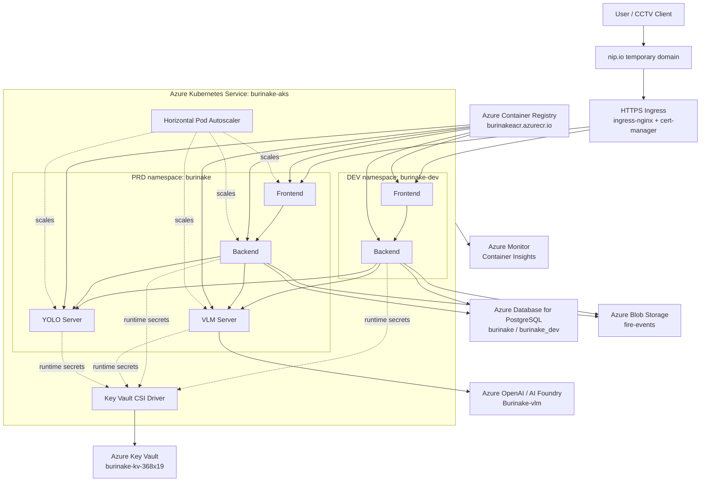
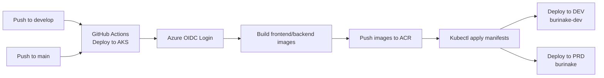
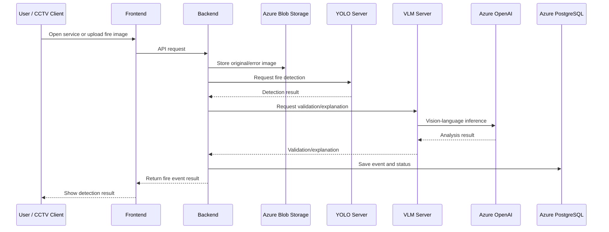

# Current AKS Architecture

## High-Level Architecture

## CI/CD Architecture

## Runtime Request Flow

## Current Deployment Summary

| Area | Current state |
| --- | --- |
| Runtime platform | Azure Kubernetes Service |
| PRD URL | `https://burinake.20.249.106.231.nip.io` |
| DEV URL | `https://dev-burinake.20.249.106.231.nip.io` |
| Container registry | Azure Container Registry |
| Secret management | Azure Key Vault + Secrets Store CSI Driver |
| Database | Azure Database for PostgreSQL Flexible Server |
| Image storage | Azure Blob Storage |
| AI model runtime | YOLO server uses `burinake-ai-server:v2`, VLM server runs in AKS and calls Azure OpenAI |
| Monitoring | Azure Monitor Container Insights |
| Autoscaling | HPA configured for PRD workloads |
| CI/CD | GitHub Actions with Azure OIDC |

## Notes for Presentation

- The old Azure VM runtime has been removed.
- AKS is now the main runtime for the service.
- DEV and PRD are separated by Kubernetes namespaces.
- DEV is lightweight and reuses the PRD YOLO/VLM services to reduce cost.
- PRD contains the full application stack: frontend, backend, YOLO server, and VLM server.
- The YOLO runtime currently uses the legacy `burinake-ai-server:v2` image because it preserves the tested model behavior.
- GPU node pool is intentionally deferred because the current subscription quota does not allow it.
- The current domain uses `nip.io` as a temporary HTTPS domain until a real domain is connected.
